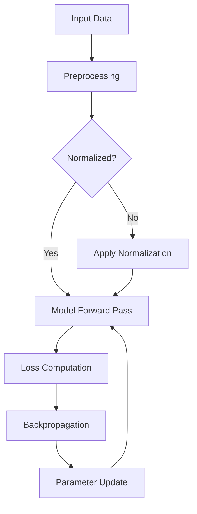
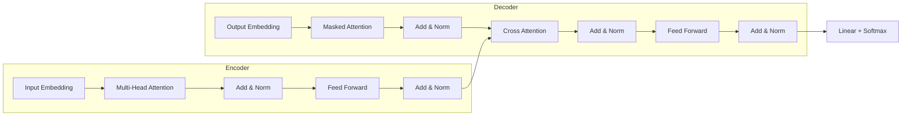
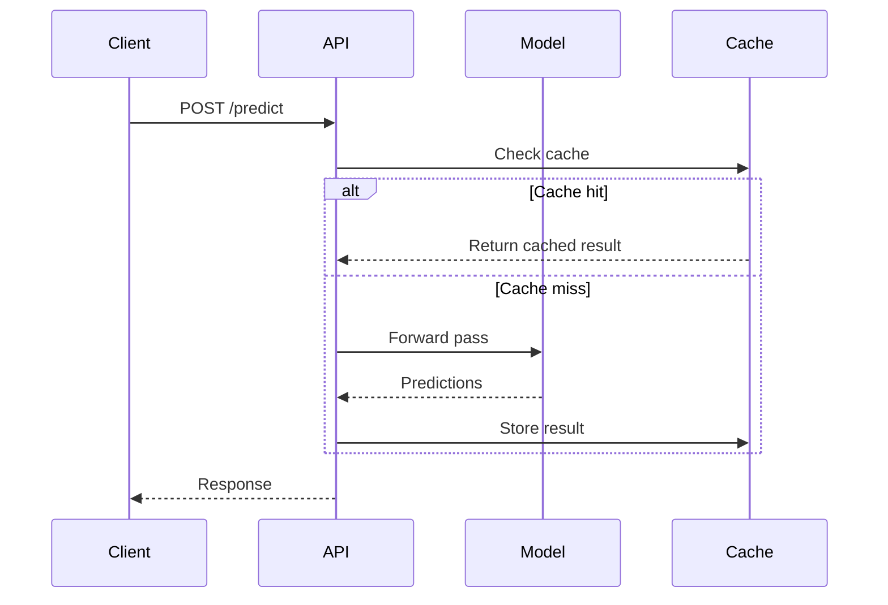
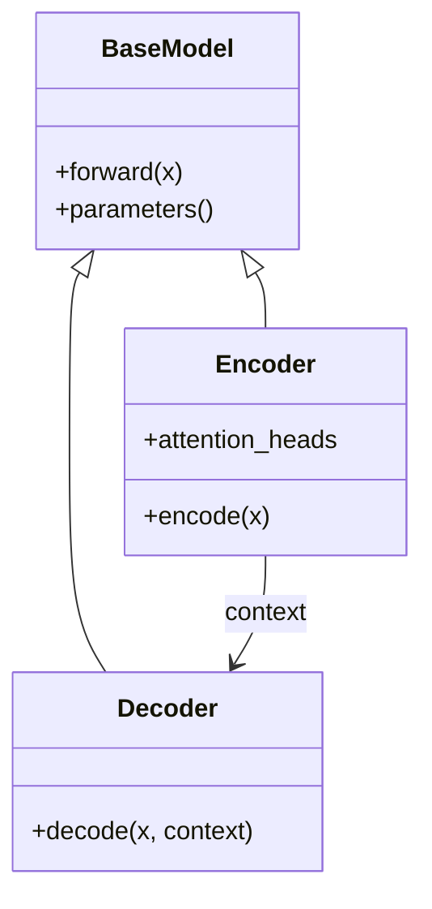
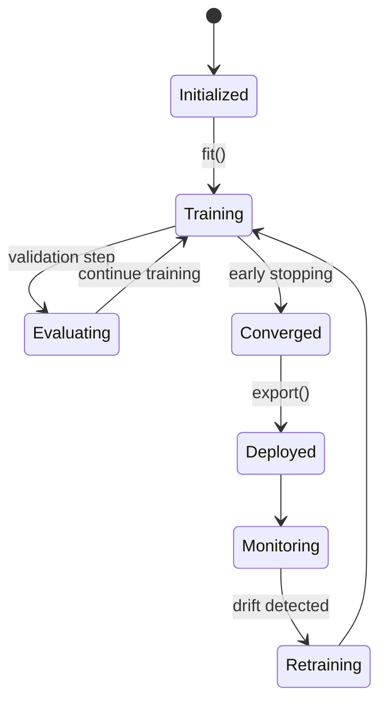
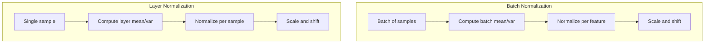

# Diagrams for Technical Blog Posts

Mermaid diagram patterns, ASCII art conventions, and guidance on when to use visuals.

## Table of Contents

- [HTML Figure Convention (Jekyll Default)](#html-figure-convention-jekyll-default)
- [When to Use Diagrams](#when-to-use-diagrams)
- [Mermaid Diagram Patterns](#mermaid-diagram-patterns)
- [ASCII Art Conventions](#ascii-art-conventions)
- [LaTeX-Style Math Diagrams](#latex-style-math-diagrams)
- [Diagram Placement Guidelines](#diagram-placement-guidelines)

---

## HTML Figure Convention (Jekyll Default)

The default Jekyll blog uses custom HTML for figures rather than Markdown image syntax. This ensures numbered captions, consistent sizing, and proper text references.

### Figure Template

```html
<div class='figure'>
    
    <div class='caption'>
        <span class='caption-label'>Figure N.</span> Caption text that
        fully describes what the figure shows. The caption should be
        self-contained — a reader should understand the figure from
        the caption alone.
    </div>
</div>
```

### Figure Sizing Guide

| Content Type | Width | Example |
|-------------|-------|---------|
| Simple diagram, icon, or equation plot | 40-60% | Single distribution curve, small schematic |
| Detailed diagram or multi-part figure | 70-80% | Architecture diagram, comparison chart |
| Full-width visualization | 90-100% | Wide data plot, complex flow diagram |

Always include `min-width: 250px` to prevent figures from becoming unreadable on mobile.

### Image Path Convention

Images are stored in `/image/[topic-slug]/` and referenced with absolute paths:

```
/image/variational-inference/elbo-geometry.png
/image/batch-normalization/loss-landscape.png
```

The topic slug matches the post's conceptual topic. Multiple related posts can share an image directory.

### Figure Design Rules

Following the blog's design philosophy ("consistency by default, differentiation for emphasis"):

- **Consistent colors** across all figures in a post — pick a palette and stick to it
- **Consistent label fonts** — use Arial/Helvetica for figure labels
- **Consistent line weights** — use weight variation only to establish hierarchy (primary lines thicker, secondary thinner)
- **White/light backgrounds** — match the blog's clean aesthetic
- **No decorative elements** — no drop shadows, gradients, or 3D effects unless they convey information

### Caption Conventions

- Period after figure number: **"Figure 1."** not "Figure 1:"
- Caption is a complete sentence or phrase that stands alone
- Describe what the figure *shows*, not what it *is*: "The loss landscape with batch normalization is significantly smoother." not "Loss landscape diagram."
- Reference specific visual elements when helpful: "The dashed line represents the theoretical optimum."

### Text Reference Requirement

Every figure must be referenced in the body text. Never include an unreferenced figure.

- "Consider Figure 3, which shows..."
- "As shown in Figure 2, the gradient..."
- "Figure 1 illustrates the relationship between..."

### Mermaid in Jekyll

Jekyll does not natively render Mermaid diagrams. Options:

1. **Render to PNG/SVG externally** (recommended) — use Mermaid CLI (`mmdc`) or the Mermaid Live Editor, export as image, include via the HTML figure convention above
2. **Add a Mermaid JS include** — add the Mermaid JavaScript library to the layout for client-side rendering (adds page weight)

For the default setup, prefer option 1: render externally and include as a static image.

### Visual Progression Rule

When a post includes multiple figures:

- **Simple visuals before complex** — introduce basic diagrams before detailed ones
- **Build on each other** — later figures should extend or zoom into earlier ones
- **Consistent visual language** — if Figure 1 uses blue for "input," all figures use blue for "input"

---

## When to Use Diagrams

### Use a Diagram When

| Situation | Diagram Type | Example |
|-----------|-------------|---------|
| Showing data/control flow | Flowchart | "How a request travels through the system" |
| Comparing approaches | Side-by-side flowcharts | "Batch norm vs layer norm data flow" |
| Showing component relationships | Class/block diagram | "Transformer architecture overview" |
| Sequential process | Sequence diagram | "Training loop: forward, loss, backward, update" |
| Hierarchical structure | Tree diagram | "Decision tree for choosing an optimizer" |
| State transitions | State diagram | "Model lifecycle: training, evaluation, deployment" |
| Timeline/progression | Gantt or timeline | "Evolution of attention mechanisms" |

### Skip the Diagram When

- The concept is well-served by a code example instead
- The relationship is simple enough for a sentence ("A calls B")
- The diagram would just restate a table
- Adding it would interrupt the reading flow without adding clarity

### Rule of Thumb

If a paragraph requires more than two re-reads to visualize the relationships, add a diagram.

---

## Mermaid Diagram Patterns

Mermaid renders natively in most Markdown-based blogs (Hugo, Astro with plugin, Next.js with rehype-mermaid, GitHub).

### Flowchart: Data/Control Flow



Use for: Algorithm steps, data pipelines, decision processes.

Conventions:
- `[Text]` for process steps (rectangles)
- `{Text}` for decision points (diamonds)
- `-->|Label|` for labeled edges
- Top-down (`TD`) for sequential processes, left-right (`LR`) for pipelines

### Flowchart: Architecture Overview



Use for: System architectures, model structures, component relationships.

### Sequence Diagram: Interactions



Use for: API interactions, multi-component communication, training loops with external services.

### Class Diagram: Component Relationships



Use for: Code architecture, class hierarchies, module relationships.

### State Diagram: Lifecycle



Use for: Model lifecycle, system states, process stages.

### Comparison: Side-by-Side Subgraphs



Use for: Comparing algorithms, approaches, or architectures side by side.

---

## ASCII Art Conventions

For environments without Mermaid support, or for inline diagrams within code comments.

### Matrix Operations

```
Input         Weight        Output
[x1 x2 x3] × [w11 w12]  = [y1 y2]
              [w21 w22]
              [w31 w32]
(1×3)         (3×2)        (1×2)
```

### Network Architecture

```
Input Layer    Hidden Layer    Output Layer
  [x1] ───┐
           ├──→ [h1] ───┐
  [x2] ───┤             ├──→ [y1]
           ├──→ [h2] ───┤
  [x3] ───┘             └──→ [y2]
```

### Pipeline Flow

```
Raw Data → Clean → Feature Eng → Train/Test Split
                                      │
                              ┌───────┴────────┐
                              ▼                 ▼
                          Train Set         Test Set
                              │                 │
                              ▼                 ▼
                          Model.fit()      Model.predict()
                              │                 │
                              └────────┬────────┘
                                       ▼
                                   Evaluate
```

### Decision Tree

```
                    Is n > 1000?
                   /            \
                 Yes             No
                /                 \
      Use SGD variant        Use full-batch GD
       /        \
    Sparse?    Dense?
     /            \
  Adam        SGD+Momentum
```

### ASCII Art Guidelines

- Use box-drawing characters (`─ │ ┌ ┐ └ ┘ ├ ┤ ┬ ┴ ┼`) for clean lines
- Use arrows (`→ ← ↑ ↓ ▶ ▼`) for direction
- Keep width under 70 characters for code block readability
- Add dimension annotations for matrix operations
- Label edges when showing multiple paths

---

## LaTeX-Style Math Diagrams

For posts with heavy math content, describe computation graphs using aligned equations with visual structure.

### Computation Graph as Equations

```markdown
**Forward pass:**
$$z^{[1]} = W^{[1]}x + b^{[1]}$$
$$a^{[1]} = \text{ReLU}(z^{[1]})$$
$$z^{[2]} = W^{[2]}a^{[1]} + b^{[2]}$$
$$\hat{y} = \sigma(z^{[2]})$$

**Backward pass** (reading bottom to top):
$$\frac{\partial L}{\partial z^{[2]}} = \hat{y} - y$$
$$\frac{\partial L}{\partial W^{[2]}} = \frac{\partial L}{\partial z^{[2]}} \cdot a^{[1]T}$$
$$\frac{\partial L}{\partial a^{[1]}} = W^{[2]T} \cdot \frac{\partial L}{\partial z^{[2]}}$$
$$\frac{\partial L}{\partial z^{[1]}} = \frac{\partial L}{\partial a^{[1]}} \odot \text{ReLU}'(z^{[1]})$$
```

Use this pattern when the math IS the diagram — the equations show the flow.

---

## Diagram Placement Guidelines

### Before vs. After Explanation

| Placement | When to Use |
|-----------|------------|
| **Before** the explanation | Architecture overviews, system designs — give the big picture first, then explain components |
| **After** the explanation | Algorithm details — explain the concept, then show the visual summary |
| **Inline** with explanation | Step-by-step processes — show each step as it's described |

### Caption Conventions

For the default Jekyll blog, use the HTML figure convention from the top of this document. For other platforms, use Markdown italics:

```markdown
*Figure 1. Data flow through the transformer encoder. Multi-head attention outputs are added to the input (residual connection) before layer normalization.*
```

Caption rules:
- Use a period after the figure number: **"Figure 1."** not "Figure 1:"
- Describe what the diagram shows (not "Diagram of X" but "X showing Y")
- Self-contained — reader should understand the diagram from the caption alone
- Reference specific elements ("the dashed line represents...")

### Sizing Guidance

- **Full-width diagrams**: Architecture overviews, complex flowcharts
- **Inline/small diagrams**: Simple comparisons, matrix operations
- **Side-by-side**: When comparing two approaches (use Mermaid subgraphs)
